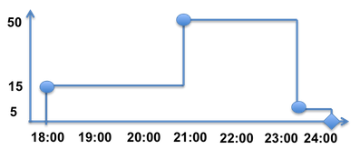

============
Statistics
============
.. default-domain:: js

The SIM.JS library provides three utility classes for recording and analyzing statistics: ``Data Series``, ``Time Series`` and ``Population``.

:ref:`Data Series <statistics-data-series>` is a collection of discrete, time-independent observations, for example, grades of each student in a class, length of rivers in United States. The :class:`~Sim.DataSeries` class provides a
convenient API for recording and analyzing such observations, such as finding
maximum and minimum values, statistical properties like average and standard deviation and so on.

:ref:`Time Series <statistics-time-series>` is a collection of discrete time-dependent observations. That is, each observation value is associated with a discrete time instance (the time at which the observation was made). For example, the size of queue at time *t* during the simulation run, number of customers in a restaurant at time *t* during evening hours. Note that the time instances when the observations are made are discrete. Also note the difference between ``Data Series`` statistics which records time independent statistics. The :class:`~Sim.TimeSeries` class provides a convenient API for recording and analyzing such observations, such as finding
maximum and minimum values, statistical properties like time-averaged mean and standard deviation and so on.

:ref:`Population <statistics-population>` is actually a composite of the above two statistics, which models the behavior of population growth and decline. Consider a room where people may enter, stay for a while and then leave. The *enter* event will increase the population count, while the *leave* will decrease the population count of the room. For this room, we are interested in two statistics:

1. The average population of the room. Note that this is a *Time Series* statistics (observation is number of people in room at some discrete time instance). The statistical information for the size of the population is contained in the :attr:`~Sim.Population.sizeSeries` attribute, which is an object of the :class:`~Sim.TimeSeries` class.
2. The average duration that people stayed in the room. Note that is a *Data Series* statistics (observations are stay duration for each person, and are independent of time). The statistical information for the stay duration is contained in the :attr:`~Sim.Population.durationSeries` attribute, which is an object of the :class:`~Sim.DataSeries` class.

The ``Population`` statistics is used very often to study the behaviors of *queues*.

.. _statistics-data-series:

Data Series Statistics
=========================

Data Series is a collection of discrete, time-independent observations, and the :js:class:`~Sim.DataSeries` class provides an API for recording and analyzing statistics.

An object of the :js:class:`~Sim.DataSeries` is created for each observation set:

.. code-block:: js

	var studentGrades = new Sim.DataSeries("Student Grades");
	var riverLengths = new Sim.DataSeries("Length of Rivers in US");

The observation values are recorded through the :func:`~Sim.DataSeries.record` function. This function optionally takes a *weight* parameter to adjust the weight of the given observation:

.. code-block:: js

	studentGrades.record(3.0);       // Alice
	riverLengths.record(2320.0);  // Mississippi (miles)
	experimentData.record(1.5, 0.8); // Value = 1.5, Weight = 0.8

The DataSeries class computes statistical properties of the observation values, including :func:`~Sim.DataSeries.count`, :func:`~Sim.DataSeries.min`, :func:`~Sim.DataSeries.max`, :func:`~Sim.DataSeries.sum`, :func:`~Sim.DataSeries.sumWeighted`, :func:`~Sim.DataSeries.average` (mean), :func:`~Sim.DataSeries.deviation` (standard deviation) and :func:`~Sim.DataSeries.variance`. Data can be recorded as histograms via the :func:`~Sim.DataSeries.setHistogram` function.

An example:

.. code-block:: js
	
	var data = new Sim.DataSeries('Simple Data');
	for (var i = 1; i <= 100; i++) {
		data.record(i);
	}
	data.count(); // = 100
	data.min();   // = 1.0
	data.max();   // = 100.0
	data.range(); // = 99.0
	data.sum();   // = 5050.0
	data.average(); // 50.5
	data.deviation(); // = 28.86607004772212
	data.variance(); // = 833.25

API Reference
----------------

.. js:class:: Sim.DataSeries([name])

	``name`` is an optional parameter used for identifying the statistics in a report.
	
.. js:function:: Sim.DataSeries.record(value[, weight])
	
	Records an observation ``value`` and an optional ``weight``. If the weight argument is omitted, it is assigned the default value of 1.0.

.. js:function :: Sim.DataSeries.reset()

	Resets the statistics. If a histogram was set earlier with :func:`~Sim.DataSeries.setHistogram`, then the histogram settings (lower bound, upper bound and number of buckets) are retained, but the count for each bucket is reset to 0.

.. js:function:: Sim.DataSeries.count()

	The number of observations recorded so far.

.. js:function:: Sim.DataSeries.min()

	The minimum value from all observations recorded so far.

.. js:function:: Sim.DataSeries.max()

	The maximum value from all the observations recorded so far.

.. js:function:: Sim.DataSeries.sum()

	The sum of all observation values recorded so far. Note that this does not consider the
	``weight`` for the values. See :func:`~Sim.DataSeries.sumWeighted` for
	weighted sum.

.. js:function:: Sim.DataSeries.sumWeighted()

	The weighted sum of all observation values recorded so far.

.. js:function:: Sim.DataSeries.average()

	The weighted average of all observation values recorded so far.

.. js:function:: Sim.DataSeries.deviation()

	The standard deviation of observation values recorded so far.

.. js:function:: Sim.DataSeries.variance()
	
	The variance of the observation values recorded so far.

.. js:function:: Sim.DataSeries.setHistogram(lower, upper, nbuckets)

	Prepares a histogram for recording frequency of occurrence of values. The histogram has ``nbucket`` number of buckets, spanning the range of [``lower``, ``upper``].
	
	Only the values that are recorded (via the :js:func:`~Sim.DataSeries.record` function) *after* the histogram was created will be taken into account. It is therefore recommended that ``setHistogram`` is called before recording values.
	
	If a histogram already existed by an earlier call to ``setHistogram``, that previous histogram will be deleted. Also, as noted above, only the recorded values from this point on will be entered in the new histogram.
	
	When the statistic is reset (via the :js:func:`~Sim.DataSeries.reset` function), the DataSeries object will remember the histogram structure (the lower, upper and nbuckets values) but the values themselves will be reset to 0. That is, there is no need to call setHistogram after the ``reset`` function is called.
	
.. js:function:: Sim.DataSeries.getHistogram()
	
	Return the histogram as an array. The size of the array will be (``nbuckets`` + 2). The index 0 of the array counts the number of observations that were below the ``lower`` value (as defined in :js:func:`~Sim.DataSeries.setHistogram`), the last index of the array counts the number of observations that were greater than the ``upper`` value.
	
	.. note::
		The returned array should be treated as *read-only*.

.. _statistics-time-series:

Time Series Statistics
========================

Time Series is a collection of discrete, **time-dependent** observations, and the :js:class:`~Sim.TimeSeries` class provides an API for recording and analyzing statistics.

An object of the :js:class:`~Sim.TimeSeries` class is created for each observation set:

.. code-block:: js

	var queueSize = new Sim.TimeSeries("Queue Size");
	var customers = new Sim.TimeSeries("Customers at Restaurant");

The observation values are recorded through the :func:`~Sim.TimeSeries.record` function. Each observation is a combination of (a) the value to record, and (b) the time when the observation was made. For example,

.. code-block:: js

	queueSize.record(0, 0); // size is 0 at 0 sec
	queueSize.record(1, 1.5); // size is 1 at 1.4 sec
	queueSize.record(2, 1.8); // size is 2 at 1.8 sec
	
	customer.record(15, 1800); // 15 customers at 6 pm
	customer.record(50, 2100); // 50 customers at 9 pm
	customer.record(5, 2315); // 5 customers at 11:15 pm

Few notes on the semantics of observations: when an observation (*v1*, *t1*) is recorded, it means that the value of the system is *v1*, starting at time *t1*, and will remain so until the next observation is recorded. 

For the *customer* example above, the observation will look like this:

The three circles represent the three observations recorded. Note how the observations are *discrete* with respect to time. 

Also observe that (*v1*, *t1*) record will not be "*committed*" until a next observation (*v2*, *t2*) is made (since only then we will know that the value *v1* was applicable for the duration *t1* - *t2*). The :func:`~Sim.TimeSeries.finalize` function can be used to commit the last observation.

The TimeSeries class computes statistical properties of the observation values, including :func:`~Sim.TimeSeries.count`, :func:`~Sim.TimeSeries.min`, :func:`~Sim.TimeSeries.max`, :func:`~Sim.TimeSeries.sum`, :func:`~Sim.TimeSeries.average` (mean), :func:`~Sim.TimeSeries.deviation` (standard deviation) and :func:`~Sim.TimeSeries.variance`. Data can be recorded as histograms via the :func:`~Sim.TimeSeries.setHistogram` function.

Note that the ``average``, ``deviation`` and ``variance`` statistics are *averaged over time*.

API Reference
----------------

.. js:class:: Sim.TimeSeries([name])

	``name`` is an optional parameter used for identifying the statistics in a report.
	
.. js:function:: Sim.TimeSeries.record(value, timestamp)
	
	Records an observation ``value`` made at time ``timestamp``.

.. js:function:: Sim.TimeSeries.finalize(timestamp)

	Call this function after the last observation was recorded.

.. js:function :: Sim.TimeSeries.reset()

	Resets the statistics. If a histogram was set earlier with :func:`~Sim.TimeSeries.setHistogram`, then the histogram settings (lower bound, upper bound and number of buckets) are retained, but the count for each bucket is reset to 0.

.. js:function:: Sim.TimeSeries.count()

	The number of observations recorded so far.

.. js:function:: Sim.TimeSeries.min()

	The minimum value from all observations recorded so far.

.. js:function:: Sim.TimeSeries.max()

	The maximum value from all the observations recorded so far.

.. js:function:: Sim.TimeSeries.sum()

	The sum of all observation values recorded so far.

.. js:function:: Sim.TimeSeries.average()

	The time average of all observation values recorded so far.

.. js:function:: Sim.TimeSeries.deviation()

	The standard deviation of observation values recorded so far.

.. js:function:: Sim.TimeSeries.variance()
	
	The variance of the observation values recorded so far.

.. js:function:: Sim.TimeSeries.setHistogram(lower, upper, nbuckets)

	Prepares a histogram for recording frequency of occurrence of values. The histogram has ``nbucket`` number of buckets, spanning the range of [``lower``, ``upper``].
	
	Only the values that are recorded (via the :js:func:`~Sim.TimeSeries.record` function) *after* the histogram was created will be taken into account. It is therefore recommended that ``setHistogram`` is called before recording values.
	
	If a histogram already existed by an earlier call to ``setHistogram``, that previous histogram will be deleted. Also, as noted above, only the recorded values from this point on will be entered in the new histogram.
	
	When the statistic is reset (via the :js:func:`~Sim.TimeSeries.reset` function), the DataSeries object will remember the histogram structure (the lower, upper and nbuckets values) but the values themselves will be reset to 0. That is, there is no need to call setHistogram after the ``reset`` function is called.
	
.. js:function:: Sim.TimeSeries.getHistogram()
	
	Return the histogram as an array. The size of the array will be (``nbuckets`` + 2). The index 0 of the array counts the number of observations that were below the ``lower`` value (as defined in :js:func:`~Sim.TimeSeries.setHistogram`), the last index of the array counts the number of observations that were greater than the ``upper`` value.
	
	.. note::
		The returned array should be treated as *read-only*.

.. _statistics-population:

Population Statistics
=======================

*Population* models the behavior of population growth and decline. This class supports two basic operations: 

(1) :func:`~Sim.Population.enter` to indicate that one entity has entered the system and the population has increased by one (*birth* event), and 
(2) :func:`~Sim.Population.leave` to indicate that one entity has left the system and the population has decreased by one (*death* event).

Population itself is a composite of two statistics:

1. :attr:`Sim.Population.sizeSeries`: a statistic of ``TimeSeries`` type which records the population of the system as a function of time.
2. :attr:`Sim.Population.durationSeries`: a statistic of ``DataSeries`` type which records the stay duration of each entity.

Consider the following example:

.. code-block:: js
	
	var motel0 = new Sim.Population("Motel 0");
	motel0.enter(1600); // one person entered at 4:00 pm
	motel0:enter(1600); // second person entered at 4:00 pm
	motel0.leave(1600, 1601); // one person who entered at 4:00 pm, left at 4:01 pm
	motel0.enter(1630); // another person entered at 4:30 pm
	motel0.leave(1630, 1700); // person who entered at 4:30 pm left at 5:00 pm
	
	motel0.finalize(1700); // No more observations after this
	
	motel0.current(); // current population = 1
	motel0.sizeSeries.average(); // average population in motel
	motel0.durationSeries.average(); // average stay duration in motel

API Reference
---------------

.. js:class:: Sim.Population([name])

	``name`` is an optional parameter used for identifying the statistics in a report.

.. js:attribute:: Sim.Population.sizeSeries
	
	A statistic of :class:`Sim.TimeSeries` type that records the size of the population of the system. Refer to :ref:`Time Series <statistics-time-series>` for the APIs for this attribute.

.. js:attribute:: Sim.Population.durationSeries

	A statistic of :class:`Sim.DataSeries` type that records the stay duration of the entities. Refer to :ref:`Data Series <statistics-data-series>` for the APIs for this attribute.

.. js:function:: Sim.Population.current()
	
	The current population of the system.
	
.. js:function:: Sim.Population.enter(timestamp)
	
	An entity has entered the system at ``timestamp``.

.. js:function:: Sim.Population.leave(enteredAt, leaveAt)

	An entity that entered the system at ``enteredAt`` will leave at ``leaveAt``.

.. js:function:: Sim.Population.finalize(timestamp)

	Call this function after the last observation was recorded.

.. js:function :: Sim.Population.reset()

	Resets the statistics.
